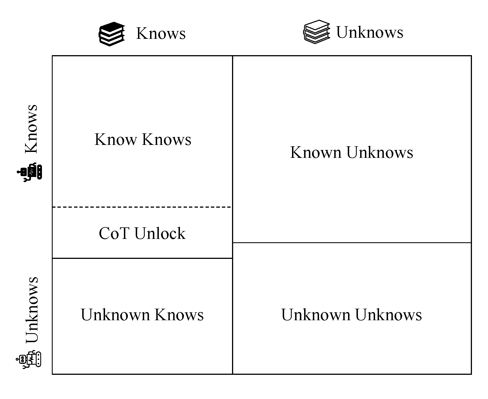

# Do Large Language Models Know What They Don’t Know?


Findings of ACL 2023: [Do Large Language Models Know What They Don’t Know?](https://arxiv.org/pdf/2305.18153.pdf)

## Introduction 📝

This repository contains the code and data related to the paper "[Do Large Language Models Know What They Don’t Know?](https://arxiv.org/pdf/2305.18153.pdf)". In this paper, we explore and analyze the self-knowledge of large language models, and provide a dataset called *SelfAware* for evaluating the self-knowledge of these models. *SelfAware* includes 1032 unanswerable questions and 2337 answerable questions. We use the F1 score to evaluate the self-knowledge of large language models, and propose an automated method for extracting uncertainty meanings from the outputs of large language models.


## Quick Links 🔗

- [Do Large Language Models Know What They Don’t Know?](#do-large-language-models-know-what-they-dont-know)
  - [Introduction 📝](#introduction-)
  - [Quick Links 🔗](#quick-links-)
  - [Requirements 📚](#requirements-)
  - [Data 💾](#data-)
  - [Reproducing Baselines 🚀](#reproducing-baselines-)
  - [Evaluation 💻](#evaluation-)
  - [Bug or Questions? 🤔](#bug-or-questions-)
  - [Citation 📖](#citation-)

## Requirements 📚
Please make sure you have the following requirements installed:
- openai
- torch
- backoff
- tenacity
- transformers
- sentencepiece
- jsonlines
- tqdm
- matplotlib
- ipdb
- simcse

## Data 💾

The data is located in the [SelfAware.json](data/SelfAware.json) file. When using it, please adhere to the CC-BY-SA-4.0 license. Below are some examples of the data:

Answerable questions:
```json
{
    "question_id": 3,
    "question": "Which breed of dog is bigger, Japanese Terrier or Cane Corso?",
    "answer": [
        "cane corso"
    ],
    "answerable": true,
    "source": "hotpot_train"
}
```
Unanswerable questions:
```json
{
    "question_id": 2667,
    "question": "Where are all the aliens?",
    "answer": null,
    "answerable": false,
    "source": "SelfAware"
}
```
Each entry consists of a unique question ID, the question text, the answer (which is an array that can contain multiple answers, or null for unanswerable questions), a boolean indicating if the question is answerable or not, and the source from where the question is extracted.


## Reproducing Baselines 🚀

You can replicate our experiments by running the `run_model.py` script. For instance, here is the command to run the `text-davinci-003` model with only the question as input:
```bash
python run_model.py --input-form Direct --model-name text-davinci-003
```
And this is the command to run the `gpt-3.5-turbo-0301` model with an instruction included in the input:
```bash
python run_model.py --input-form Instruction --model-name gpt-3.5-turbo-0301
```
The script primarily includes three input arguments:
- API-Key: This is your OpenAI API key, which is required to run GPT-related experiments.
- input-form: The form of the input data.
- model-name: The name of the model you're testing.
- temperature: The temperature setting when generating text. It controls the randomness of the predictions. (Default 0.7)

**Tips:**

You can also test more models as long as they're compatible with the `generate` method from the transformers library.


## Evaluation 💻

The evaluation code for SelfAware is located in `eval_model.py`. Below is an example of evaluating the `alpaca-7b` model:

```bash
python eval_model.py --filename  alpaca-7b/Direct_alpaca-7b_T_0.7.jsonl
```

The evaluation results include Precision, Recall, F1 score, and the accuracy for answerable questions.


## Bug or Questions? 🤔

If you have any suggestions or questions, feel free to email us at yinzhangyue@126.com. If you encounter any issues while using the code, or if you find any bugs, please open a new issue on GitHub. This is a preliminary work and we are very much open to any constructive feedback that could help us improve. Thank you for your attention!


## Citation 📖

If you are interested in our work, please use the following citation format when referencing our paper:
```bibtex
@inproceedings{yin-etal-2023-large,
    title = "Do Large Language Models Know What They Don{'}t Know?",
    author = "Yin, Zhangyue  and
      Sun, Qiushi  and
      Guo, Qipeng  and
      Wu, Jiawen  and
      Qiu, Xipeng  and
      Huang, Xuanjing",
    editor = "Rogers, Anna  and
      Boyd-Graber, Jordan  and
      Okazaki, Naoaki",
    booktitle = "Findings of the Association for Computational Linguistics: ACL 2023",
    month = jul,
    year = "2023",
    address = "Toronto, Canada",
    publisher = "Association for Computational Linguistics",
    url = "https://aclanthology.org/2023.findings-acl.551",
    doi = "10.18653/v1/2023.findings-acl.551",
    pages = "8653--8665"
}
```
